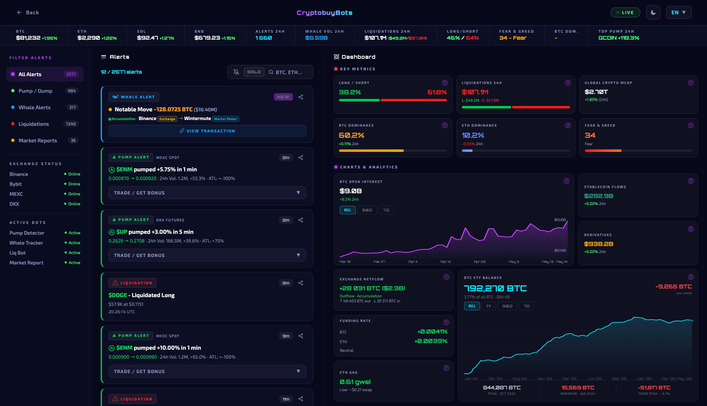
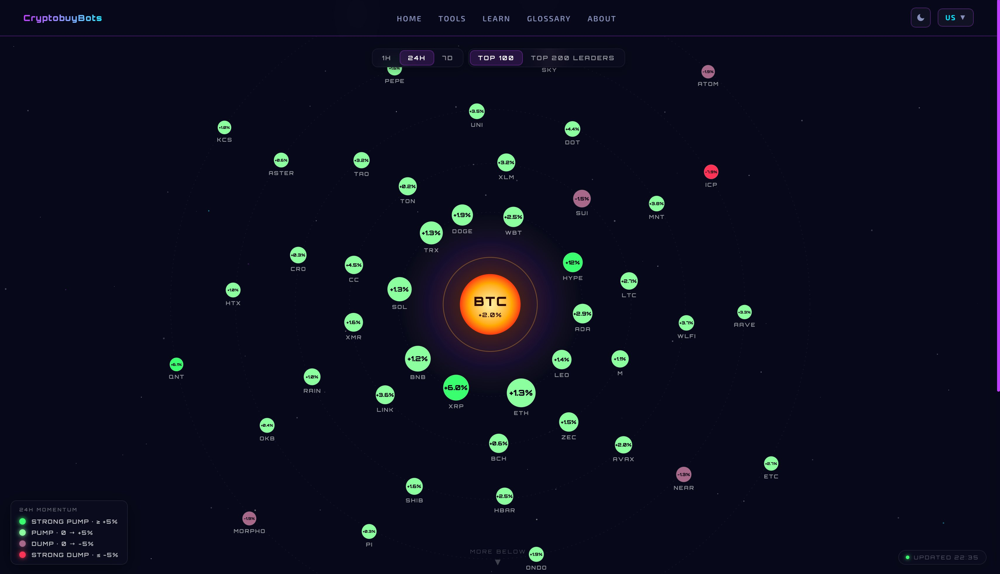
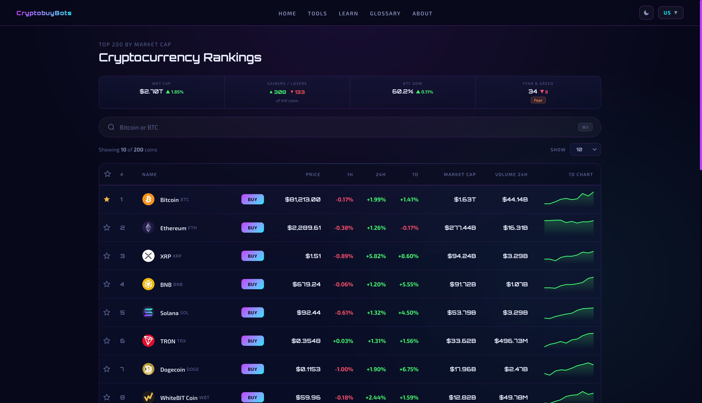
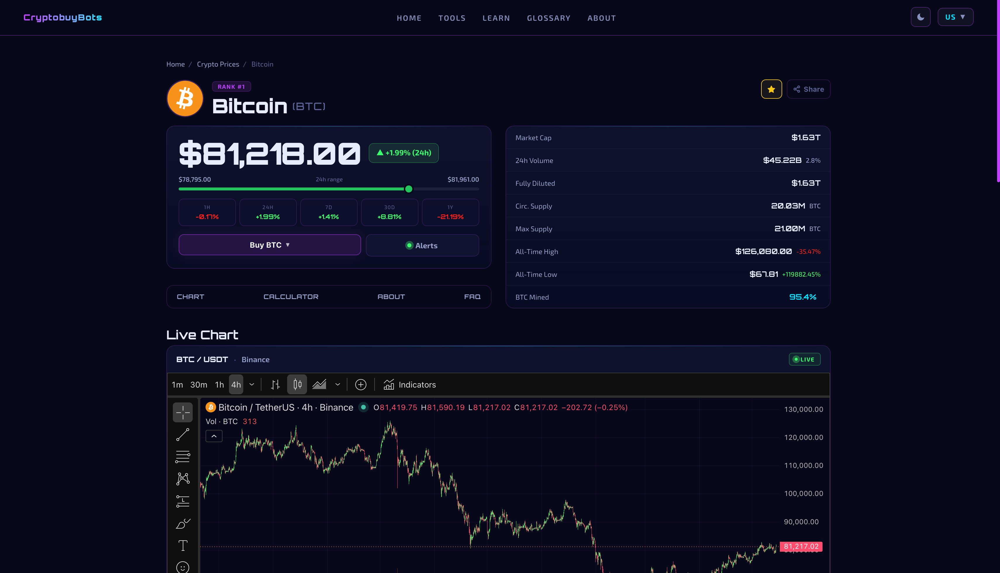
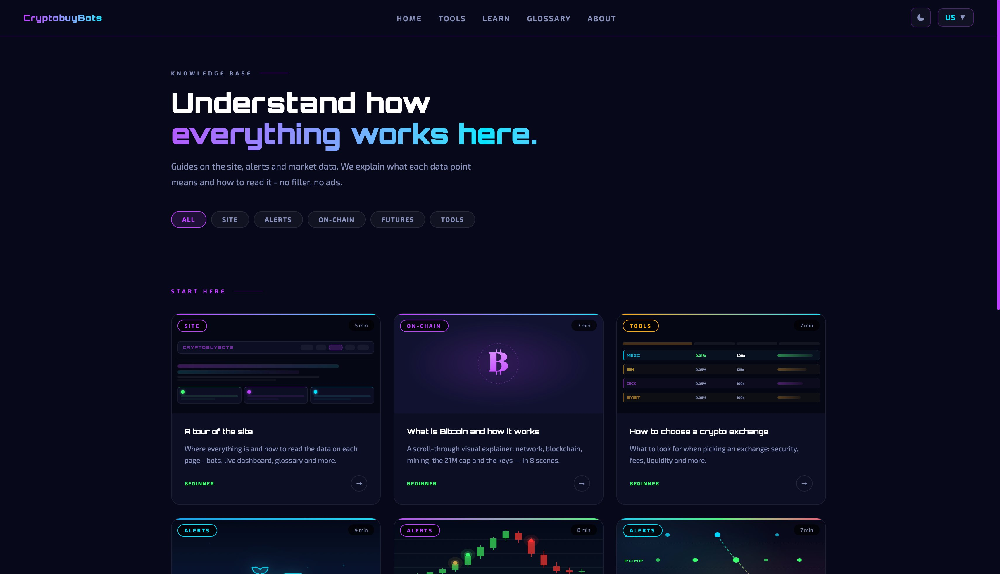
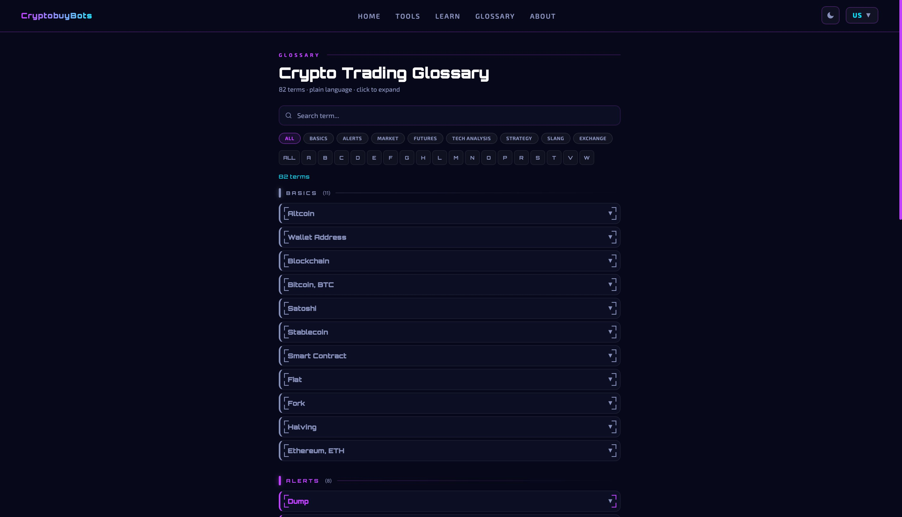

  

# CryptobuyBots

**Free crypto alert ecosystem.** Live whale moves, pump and dump signals, liquidations and market analytics, all in one place on a clean web dashboard.

 

## What it is

A real-time crypto market intelligence site. Open it and you see what whales are buying, which tokens just pumped or dumped, where liquidations are firing, and how the market is moving overall.

No signup, no paywall, no tracking, no ads.

How to use: go to [cryptobuybots.com](https://cryptobuybots.com). Nothing to install, nothing to set up.

Built and maintained by one person.

 

## Where to look

### Live Feed and Dashboard

Real-time stream of every alert (whales, pumps, dumps, liquidations, reports) with filters and a side dashboard of market metrics: long/short ratio, BTC and ETH dominance, fear and greed index, open interest, ETF balances and more.

[Open live feed →](https://cryptobuybots.com/live)

 

### Galaxy

Visual map of the crypto market. One glance to see what's pumping and what's dumping across the top 100 or top 200 coins. Filter by timeframe (1h, 24h, 7d).

[Open galaxy →](https://cryptobuybots.com/galaxy-top-crypto)

 

### Crypto Prices

Top 200 coins by market cap with sortable rankings, live prices, 1h / 24h / 7d changes, market cap and volume. Each coin has its own page with a live chart, full stats, ATH/ATL, description and FAQ.

[Open prices →](https://cryptobuybots.com/crypto-prices)

 

### Learn

Guides on the site, alerts, on-chain data, futures and tools. Plain language, no filler.

[Open learn →](https://cryptobuybots.com/learn)

 

### Glossary

82 crypto trading terms explained without buzzwords. Search, filter by category, jump by letter.

[Open glossary →](https://cryptobuybots.com/glossary)

 

## The alert engine

A set of bots watches exchanges and on-chain activity around the clock and pushes signals into the [Live Feed](https://cryptobuybots.com/live).

### Pump and dump alerts

Sudden price moves on major exchanges, flagged the moment they happen.

| Bot | Market |
|-----|--------|
| MEXC Futures Pump Alerts | Perpetuals on MEXC |
| Binance Futures Pump Alerts | Perpetuals on Binance |
| Bybit Futures Pump Alerts | Perpetuals on Bybit |
| OKX Futures Pump Alerts | Perpetuals on OKX |
| MEXC Spot Pump Alerts | Spot markets on MEXC |
| Binance Spot Pump Alerts | Spot markets on Binance |
| Bybit Spot Pump Alerts | Spot markets on Bybit |
| OKX Spot Pump Alerts | Spot markets on OKX |

### Market intelligence

| Bot | What it does |
|-----|--------------|
| Whale Tracker | Large transactions across exchanges and on-chain wallets |
| Liquidations | Forced position closures above a configurable USD threshold |
| Top 200 Futures Movers | Biggest 24h movers among the top 200 by market cap |
| Market Reports | Periodic summaries of pump and dump activity and market state |

All of them stream into the [Live Feed](https://cryptobuybots.com/live) where you can filter by alert type, exchange, or coin.

 

## What the site is and isn't

**Is:**
- 100% free
- No account needed
- No cookies, no tracking pixels, no ads
- No premium tier, no upsell, no paid plans
- Works on mobile and desktop
- Available in 8 languages: English, 中文, Español, Português, Français, हिन्दी, Українська, Русский

**Isn't:**
- A trading platform (no funds held, no orders placed)
- Financial advice
- A paid signal service or copy-trading group

How it stays free: optional exchange affiliate links and voluntary donations. Nothing locked, nothing gated.

 

## Roadmap

What's coming next:

- A built-in AI assistant for the site
- New features and pages
- Continuous design and UX polish

No fixed dates. Things ship when they're ready.

 

## Contact

- Site: [cryptobuybots.com](https://cryptobuybots.com)
- Twitter / X: [@CryptobuyBots](https://x.com/CryptobuyBots)
- Email: [contact@cryptobuybots.com](mailto:contact@cryptobuybots.com)

 

## License

The contents of this repository are licensed under the [MIT License](LICENSE).

The CryptobuyBots name, logo, and visual identity are the property of the author and are not granted under the MIT license.

 

---

If the site is useful to you, the easiest way to support it is to share a link.
